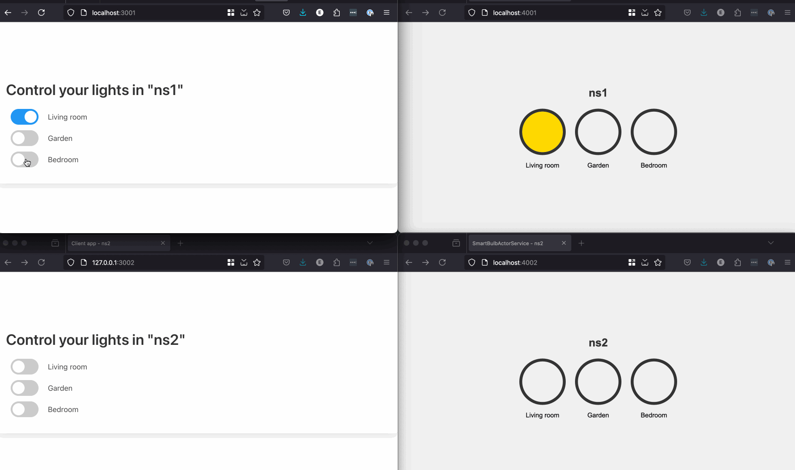

# Dapr namespaced actors demo



### Install requirements
- [Dapr CLI](https://docs.dapr.io/getting-started)
- [Kind cluster](https://kind.sigs.k8s.io/docs/user/quick-start/)
- A free [Pusher](https://www.pusher.com) account

### Setting up
Copy the `service.ini.example` file to `service.ini` and fill in the values for your [Pusher](https://www.pusher.com) account.

Run the setup script:
```bash
./setup.sh
```

Follow the instructions on screen and run the port-forwarding commands. When the forwarding is set up, you can open four browser tabs to simulate a client and server app in two namespaces.
