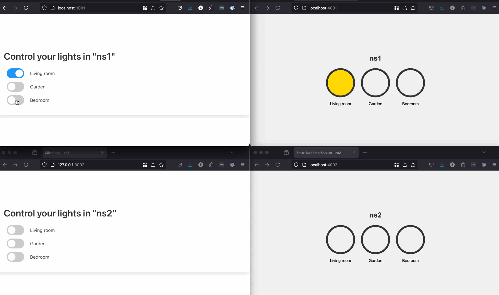

# Dapr namespaced actors demo



This demo shows how to run [Dapr actors](https://docs.dapr.io/developing-applications/building-blocks/actors/actors-overview/) across two Kubernetes namespaces on a local kind cluster, simulating client/server traffic between namespaces. A smart-bulb actor service is deployed into two namespaces, and a client app in each namespace talks to its local actor; a [Pusher](https://www.pusher.com)-backed UI streams events from both namespaces to four browser tabs so you can watch the namespaced traffic side by side. The demo is intended for developers exploring multi-tenant or environment-isolation patterns with Dapr actors.

### Install requirements
- [Dapr CLI](https://docs.dapr.io/getting-started)
- [Kind cluster](https://kind.sigs.k8s.io/docs/user/quick-start/)
- A free [Pusher](https://www.pusher.com) account

### Setting up
Copy the `service/config.ini.example` file to `service/config.ini` and fill in the values for your [Pusher](https://www.pusher.com) account.

Run the setup script:
```bash
./setup.sh
```

Follow the instructions on screen and run the port-forwarding commands. When the forwarding is set up, you can open four browser tabs to simulate a client and server app in two namespaces.

## Project structure

- `service/` — Smart-bulb actor service (Python). Contains `smartbulb_actor.py`, `smartbulb_actor_service.py`, `smartbulb_actor_interface.py`, the FastAPI/Flask host, `Dockerfile`, and `config.ini.example`.
- `client/` — Client app (Python) that invokes the actor. Contains `app.py`, the shared `smartbulb_actor_interface.py`, templates, and a `Dockerfile`.
- `deploy/` — Kubernetes manifests for deploying the client and service into the two namespaces.
- `setup.sh` — Script that builds images, loads them into kind, and applies the manifests.
- `demo.gif` — Recording of the demo in action.

---

Join the [Dapr Discord](https://diagrid.ws/dapr-discord) for Q&A and chat with other community members!
